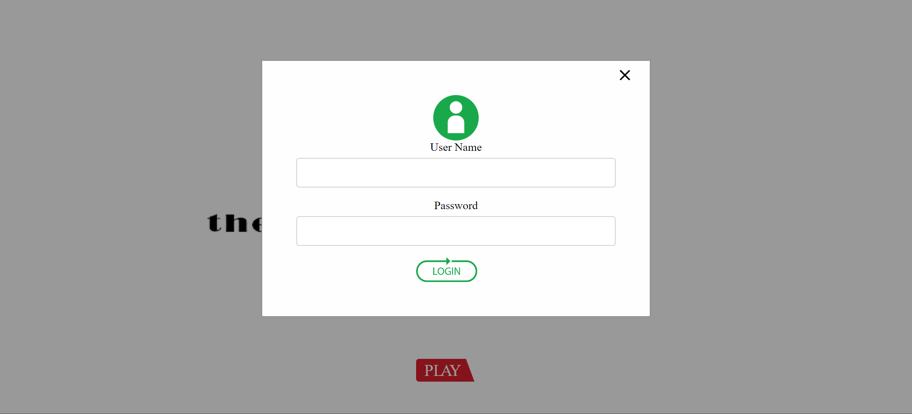
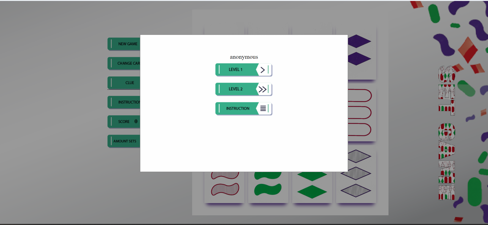
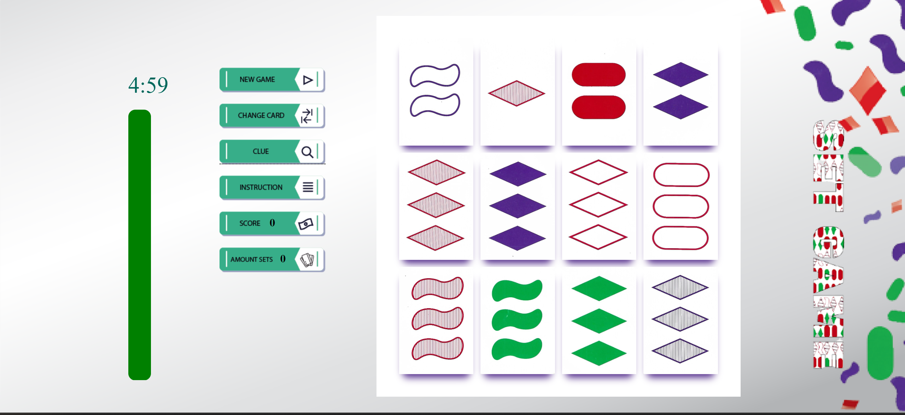

# Set Game


This project is a web-based implementation of the Set game, developed using HTML, CSS, and JavaScript. The focus is on correct coding practices, clean code, proper element hierarchy, and advanced, responsive design.

## Features

- **User Authentication**: Validate and authenticate user names and passwords.
- **Level Selection**: Choose between two difficulty levels, with the difference being the duration of the timer.
- **Game Board**: Play the Set game on a dynamically generated game board.
- **Hint Button**: Provides hints by highlighting potential sets.
- **Swap Button**: Allows swapping 3 cards from the board when no sets are available.
- **New Game Button**: Starts a new game.
- **Responsive Design**: The game is designed to be fully responsive and functional across various devices and screen sizes.

## Screenshots

Below are some screenshots of the game in action:

- **Home Page**:
  
  After you click the play button the next window will appear

- **Login screen**:
  
  
- **Level Selection**:
  Put a ❤️ that your name appears above
  

- **Game Board**:
  
  
- **Instructions**

<video width="320" height="240" controls>
  <source src="images/How_to_Play_Set.mp4" type="video/mp4">
  Your browser does not support the video tag.
</video>

  
## Installation

To run this project locally, follow these steps:

1. **Clone the repository**:
   ```bash
   git clone https://github.com/zippiL/JS-graduation-project.git
   ```
2. **Navigate to the project directory:**
    ```bash
   git cd JS-graduation-project
   ```
## Usage

### Opening the Game

Open the `homePage.html` file in your preferred web browser.

### User Authentication

- Enter a username and password on the login page.
- The system will validate the credentials and provide access to the game.

### Level Selection

- Choose the desired difficulty level from the options provided. The levels differ in the duration of the timer.

### Play the Game

- **Hint Button**: Use this button to receive hints about potential sets.
- **Swap Button**: Use this button to replace 3 cards from the board when no sets are available.
- **New Game Button**: Use this button to start a new game.
- Interact with the game board to play the Set game.

## Validation and Error Handling

- **User Name Validation**: Ensure that the username meets the required format and is not already in use.
- **Password Validation**: Ensure that the password meets security requirements.
- **Error Handling**: Inform users of invalid input or authentication failures with appropriate messages.

## Contributing

Contributions to this project are welcome! To contribute:

1. Fork the repository.
2. Create a new branch (`git checkout -b feature/YourFeature`).
3. Commit your changes (`git commit -m 'Add your feature'`).
4. Push to the branch (`git push origin feature/YourFeature`).
5. Open a Pull Request.


   

